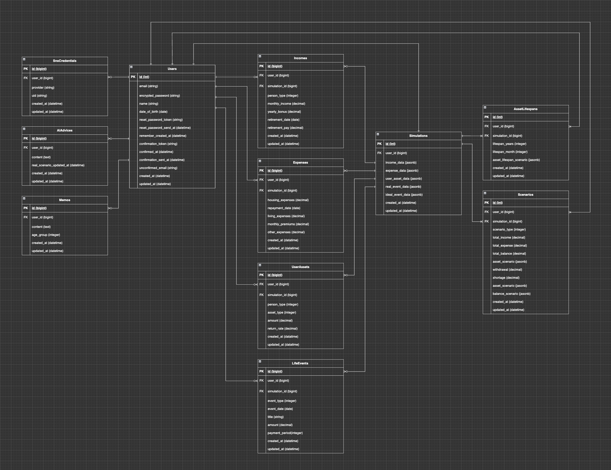

# サービス概要

## 未来を見える化し、人生設計をサポート  

本サービスは、個人の経済状況やキャリアの方向性に悩む人のための「経済シミュレーション・ライフプラン管理ツール」です。  
ユーザーの将来や現在に対する経済的な不透明さを軽減し、ライフプラン設計をサポートすることで、  
ユーザーが今後の選択やライフプランのデザインを前向きに進められるようにすることを目的としています。  

## 主な機能

### 1. 経済状態のシナリオ作成  
入力した収支やライフイベント情報を基に経済状態をシミュレーションし、ユーザーの現在と将来の状態をグラフで可視化します。  

### 2. AIアドバイス  
AIがシミュレーション結果を分析し、資産形成やキャリアプランのアドバイスを提供します。  

### 3. ライフプラン管理  
登録したライフイベントは自動で時系列に整理され、一緒にメモを残せるため、意思決定の経緯や今後の計画を記録可能です。  

### 4. 経済ニュース  
シミュレーションやライフプランニングだけでなく、日々の経済情報にも触れることができます。  

---

# このサービスへの思い・作りたい理由  

## 経済状態の把握を簡単に、納得できる将来選択を可能にする  

資産形成やキャリアの選択は、人生において大きな影響を持ちます。  
私自身、将来を具体的に想像できず、「何をどうすれば良いのか分からない」という時期がありました。  
これを解消するために、紙に計算を書き出し、試行錯誤を重ねましたが、そのプロセスは煩雑で時間がかかるものでした。  
この経験から、「手軽に経済的な今後の見通しを把握でき、計画を立てやすいサービスがあれば、同じように悩む人の役に立つのではないか」と考えました。  

本サービスは、シンプルな情報入力でユーザーの経済状態を可視化し、今後のライフプランニングもサポートします。  
曖昧なイメージではなく、具体的なシナリオを基に計画を立て、納得した状態で前へ進める人を増やしたい。  
それが、このサービスへの思いと作成理由です。  

---

# ユーザー層  

## 1. 20代後半〜40代前半の会社員  
この世代は結婚、住宅購入、子どもの教育資金、老後資金などのライフイベントを迎え、  
将来の資産形成やキャリアの方向性について漠然とした不安や経済的負担を抱えやすい時期です。  
一方で、計画の見直しやリカバリーが可能な段階でもあります。  
本サービスは、この時期に具体的な将来のイメージと行動指針を示し、早期からの修正を促すことで、今後の方針や計画のサポートを行います。  

## 2. 転職や資産運用を検討し始める方  
転職を考える人は「収支の変化による生活への影響」を、  
資産運用を始めたい初心者は「現在の収支状況と理想の整理」を求めるため、  
経済シナリオの可視化を通じて、適切なキャリア選択や資産運用の第一歩を踏み出す支援を提供します。  

---

# 利用  

## 対応デバイス  
PC、タブレット、スマートフォン  

## 利用の流れ  
下記のサイクルで、今後のイメージを具体化します。日々の経済ニュースの取得も可能です。  

1. 情報入力（経済状況、ライフイベント）  
2. シミュレーション結果確認  
3. AIアドバイス確認 & ライフプランのメモや計画の記録  
   - ニュース確認  

※ アプリ利用には、ログイン/アカウント作成が必要です。  

## 利用イメージ  

### 1. 情報入力  
シミュレーションを行うための情報を入力します。  
  

### 2. シミュレーション結果確認  
4つのシミュレーション結果が表示されます。  

1. 資産寿命  
  

2. 現実的シナリオ（必ず実現したいライフイベントを考慮した経済状況）  
  

3. 理想的シナリオ（できれば実現したいライフイベントを考慮した経済状況）  
  

4. 運用資産シナリオ  
  

### 3. AIアドバイス確認 & ライフプラン記録  
登録されたライフイベントは自動的に時系列に並び、計画やメモを記録できます。  
  

### 4. ニュースの確認  
  

---

# サービスの差別化ポイント・推しポイント  

- **柔軟なシミュレーション**  
  - ライフプランに合わせて支出項目を追加できるため、ユーザーの状況に合わせたシミュレーションが可能  
- **シミュレーション × ライフプラン管理**  
  - 登録したライフイベントにメモを記録でき、シミュレーションと考えの整理を１ストップで行える  
- **将来からの逆算シミュレーション**  
  - 将来の経済状態だけでなく、現状の経済的過不足も視覚化し、キャリア形成の見直し機会を提供  

---

# 技術構成  

## 使用技術  

| カテゴリ | 技術内容 |
| --- | --- |
| サーバーサイド | Ruby on Rails 7.2.1.1・Ruby 3.2.3 |
| フロントエンド | Ruby on Rails・JavaScript・SCSS・HTML |
| CSSフレームワーク | Bootstrap |
| Web API | OpenAI API(GPT-3.5 turbo)・GNews API |
| データベースサーバー | PostgreSQL |
| アプリケーションサーバー | Heroku・Docker |
| バージョン管理ツール | GitHub |
| CI/CDツール | GitHub Actions |

---

## ER図  
  

---