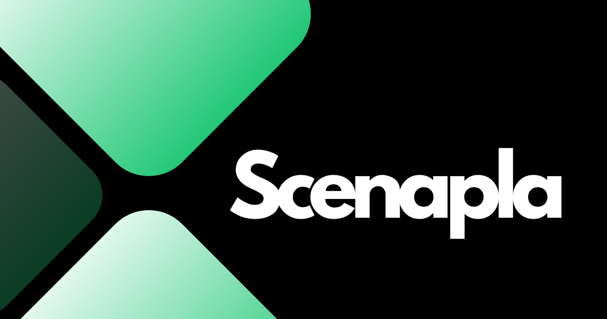
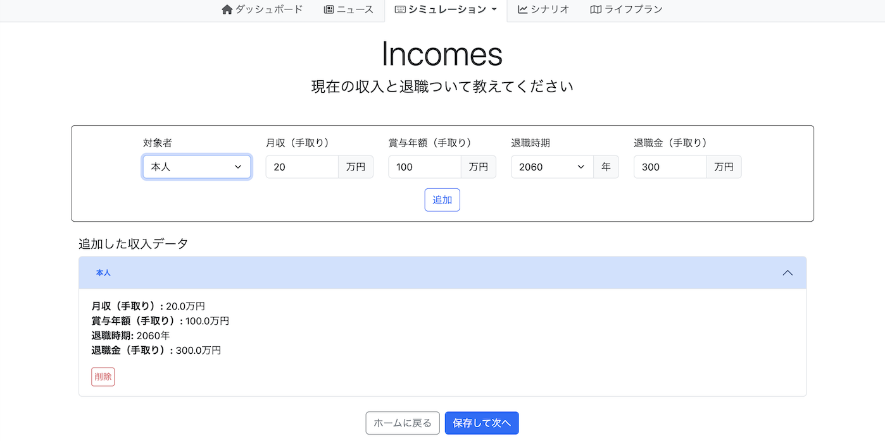
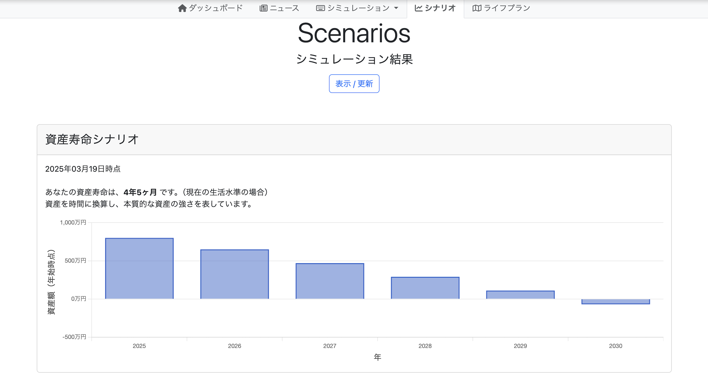
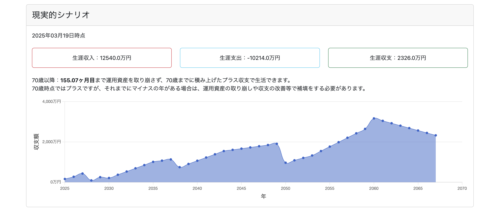
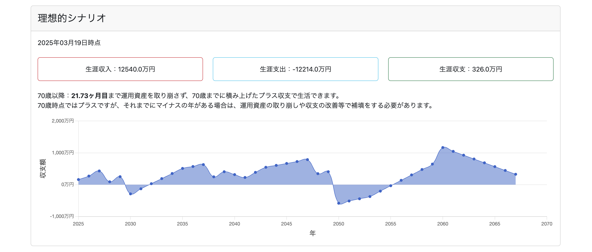
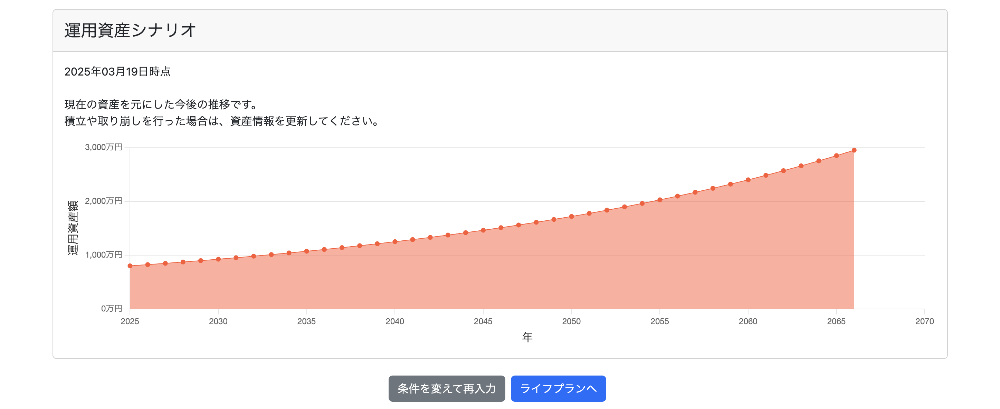
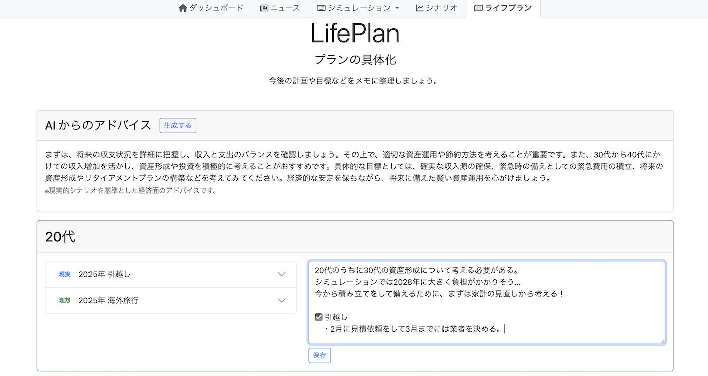
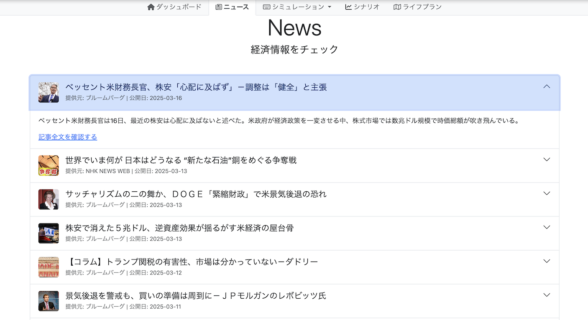

  

## 🟢 サービス名
### Scenapla（シナプラ）
現在停止中

## 🟢 サービス概要
「経済シミュレーション × ライフプラン管理」

### 機能
1. 経済状態のシナリオ作成  
    入力された経済情報とライフイベント情報を基にシミュレーションし、ユーザーの現在と将来の経済状態をグラフで可視化。

2. AIアドバイス  
    シミュレーション結果をAIが分析し、資産形成やキャリアプランのアドバイスを提供。

3. ライフプラン管理  
    登録したライフイベントは時系列に自動整理され、メモと一緒に管理する。

4. 経済ニュース  
    日々の経済情報を取得できる。

## 🟢 サービス作成の理由
資産形成やキャリアの選択は、人生において大きな影響を持つ。
しかし、その選択には、あらゆる状態やイベントの考慮が必要であり、このプロセスは煩雑で時間がかかる。
このサービスは、左記の課題の解決となる「将来への手軽な設計」を提供する。

## 🟢 利用
### 対応デバイス
- PC、スマートフォン

### 利用の流れ
- 下記1~3のサイクルで、今後のイメージを具体化

  1. 情報入力（経済状況、ライフイベント）

  2. シミュレーション結果確認

  3. AIアドバイス確認 & ライフプランやメモを記録

  - ニュース確認（オプション）

### 利用イメージ
1. ♦️**情報入力**  
    シミュレーションを行うための事前情報の入力。
    

2. ♦️**シミュレーション結果確認（4種類）**  
    1. 資産寿命シナリオ（現状資産が尽きるまでの期間）  
        

    2. 現実的シナリオ（必ず実現したいライフイベントのみを考慮した経済状況）  
        

    3. 理想的シナリオ（必ず/できれば実現したいライフイベントの両方を考慮した経済状況）  
        

    4. 運用資産シナリオ（現状資産を運用した場合の資産状況）  
        

3. ♦️**AIアドバイス確認 & ライフプラン記録**  
    計画の確認、メモの保存。  
      

4. ♦️**ニュース確認**  
    

## 🟢 サービスの強み
- 柔軟なシミュレーション  
  支出項目を任意に追加でき、個人に合う、具体的なシミュレーションが可能。

- 将来からの逆算
  今後の状態だけでなく、現状の過不足も視覚化し、資産・キャリア形成の別視点を提供。

- シミュレーション × ライフプラン管理  
  1ストップで、シミュレーションとプランの整理が可能。

## 🟢 技術構成
### 使用技術
| Category | Tech |
| --- | --- |
| Backend | Ruby on Rails 7.2.1.1, Ruby 3.2.3 |
| Frontend | HTML, SCSS, Bootstrap, JavaScript |
| Web APIs | Mailgun API, OpenAI API, GNews API |
| Database | PostgreSQL |
| Infrastructure/Virtualization | Heroku・Docker |
| Version Control | Git |
| CI/CD | GitHub Actions |

### ERD

